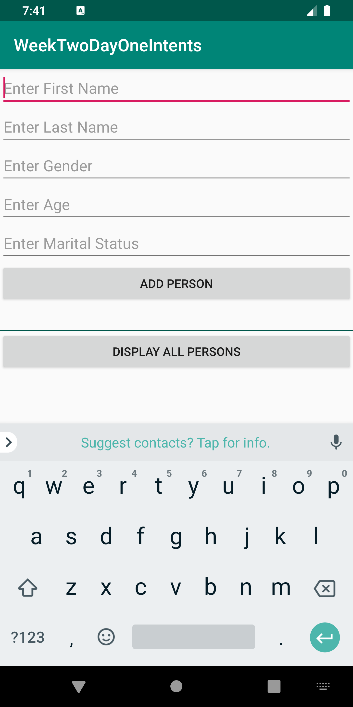
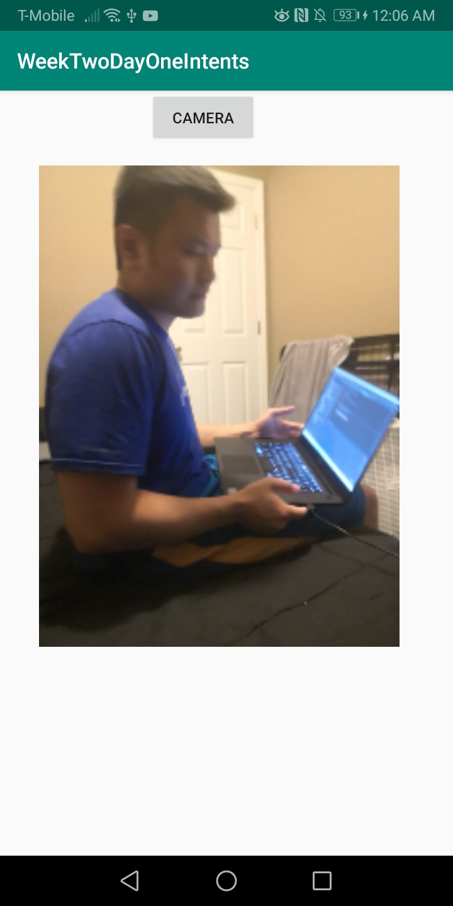
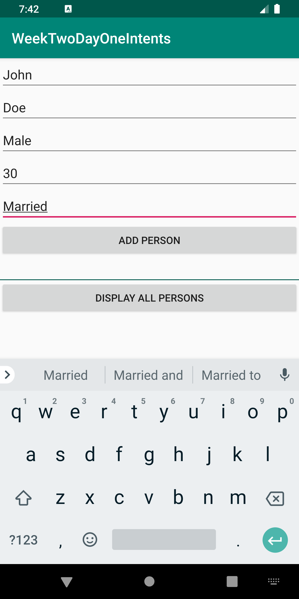
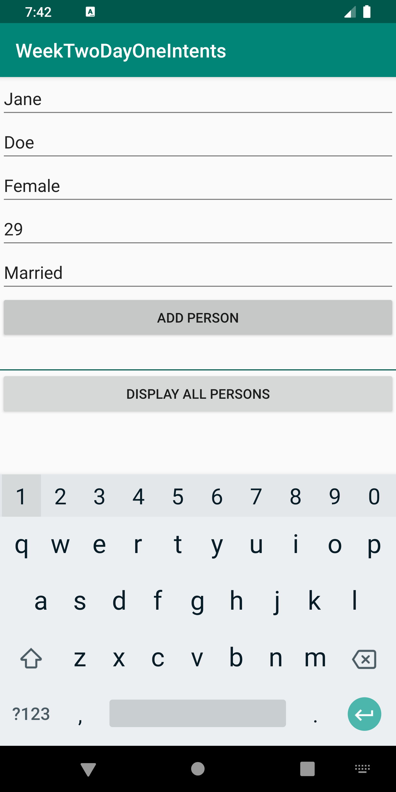
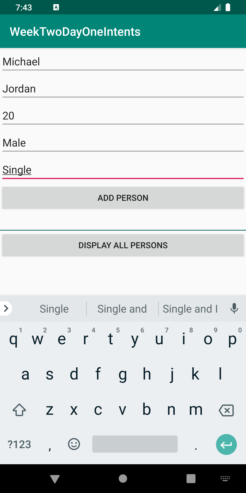
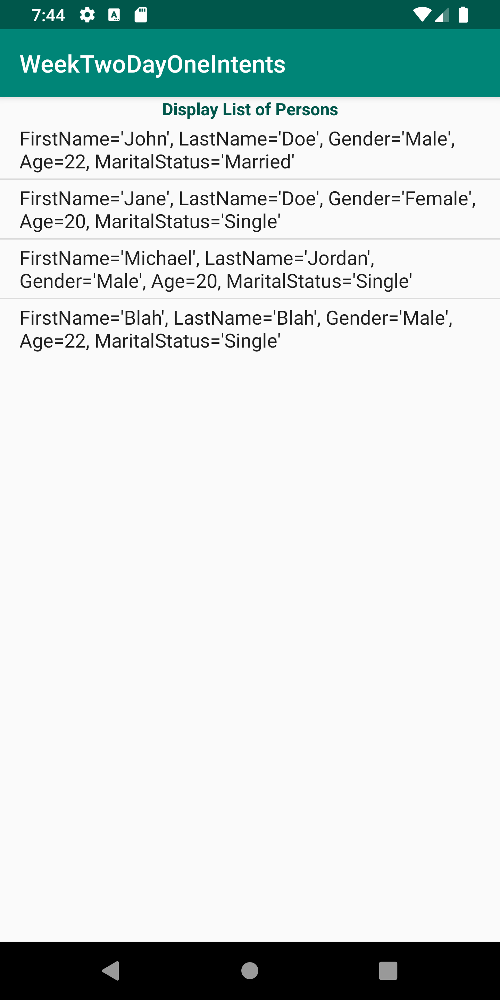

# Week2Daily1Intents
Activities and Intents

Activities and Intents Coding Project

Create a calculator app to perform all the standard calculator operations like addition, subtraction, multiplication, divide etc.  -No edittexts  -Changing the orientation to landscape(layout qualifier) will display now functionality (Scientific calculator)  Hint: Create all buttons using Relative/Grid Layout and append the values to the TextView. Show the result in a separate TextView.

Homework Week Two Day One

Coding
Create an application to have the following features
1. The user should be able to navigate to the following activities
	a. Picture Activity
		- to take a picture from the phone and show it in the ImageView.
	b. Person Activity
	c. Person Result Activity
		- have a user form to add person object and then pass the list of persons to the another activity to view all persons in a textview
	d.  At least 1 other activities
		- Play with some widgets (Media Player, Web View, etc)
2. Add backward compatibility in all activities (left arrow on the app bar)
	
DUE DATE June 25, 2019 at 8:59am ET

Instructions:

Run the Android project
- Create a new Virtual Device if not already. Then, choose Pixel 2 XL, then click OK.
- Click on each of the buttons for the corresponding activities.
- Click on the Picture Activity to take a photo shot using the camera.
- Click on WebViewActivity to direct you to google website from the app.
- Click on Person Activity to enter a Person data to the app and display.

